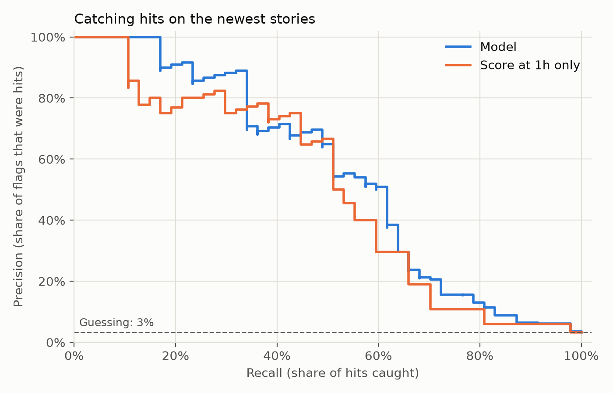

# hn-signal
[](https://github.com/zoomshields16/hn-signal/actions/workflows/ci.yml)


[](LICENSE)

Can a Hacker News story's first hour predict whether it reaches 100 points?

An ELT pipeline that follows every new HN story through its first day, with dbt turning the
raw data into tables for analysis, and a small model that tries to answer the question.
Python, Postgres, dbt, scikit-learn, GitHub Actions, hosted on Railway.

**HN API → collector (every 5 min) → Postgres (raw JSON) → dbt (every 15 min) → model**

## What I found
Partly. Only about 3.5% of stories reach 100 points, yet the first hour picks out about half
of them, and most of the stories it flags really get there. Score at one hour does most of the
work. A small model that also looks at comments and momentum does slightly better than score
alone.

On 1,426 newer stories the model had never seen:

| | Precision | Recall |
|---|---|---|
| Rule: 15+ points at one hour | 68% | 45% |
| Model | 72% | 49% |

Precision is how often a flagged story really reached 100. Recall is how many of the stories
that reached 100 got flagged.



The hard part is the slow starters. Out of 199 stories that reached 100, 44 had fewer than 5
points at the one hour mark, which is when they look like any other quiet story.

Based on 16 days of data (Sep 11 to Sep 27, 2026). The test set has only 47 hits, so treat
the gap between the model and the rule as small.

## How it works
1. **Extract and load.** A Railway cron job checks each new story every 5 minutes for its
   first two hours, then about once an hour until it's a day old. It saves the API's JSON
   to Postgres untouched. So far that's about 17,000 stories and 380,000 snapshots.
2. **Transform.** dbt runs every 15 minutes. Staging models clean up the JSON, and
   `fct_story_outcomes` gives each story one row: its score, comments and momentum at one
   hour, and whether it ever reached 100.
3. **Model.** `analysis/model.py` trains a logistic regression on older stories, tests it
   on newer ones, and compares it against the simple rule.
4. **Test and deploy.** GitHub Actions runs 44 Python tests and builds the dbt models, with
   their 12 data tests, against a throwaway Postgres on every pull request. Railway
   redeploys after a merge once CI passes.

## Tech stack
| Tool | Used for |
|---|---|
| Python (requests, psycopg) | The collector that calls the HN API and writes to Postgres |
| PostgreSQL | Stores the raw JSON and the tables dbt builds |
| dbt | SQL models that turn the raw JSON into clean tables, plus data tests |
| pandas, scikit-learn, matplotlib | The model and the chart |
| pytest | Unit tests, and database tests against a real Postgres |
| GitHub Actions | Runs every test on each pull request |
| Railway | Hosts the database and runs the collector and dbt on a schedule |

## Tables
Data moves through three layers. The raw layer keeps exactly what the API sent, so the later
layers can always be rebuilt from it.

| Table | Layer | What's in it |
|---|---|---|
| `raw_snapshots` | Raw | One row per story per check, with the API's JSON untouched |
| `collector_runs` | Raw | One row per collector run: stories due, saved and failed |
| `stg_snapshots` | Staging | Each check's score and comment count, pulled out of the JSON |
| `stg_stories` | Staging | One row per story: title, author, link, posted time, deleted or dead |
| `fct_story_outcomes` | Analytics | One row per story: its first hour and whether it reached 100 |

## What I had to get right
- **Collect new stories, not top stories.** The top stories list only shows winners, so the
  data would never include the stories that went nowhere.
- **Safe to rerun.** Each story is saved at most once per 5 minute slot, a lock stops two
  runs from overlapping, and server errors are retried. Every run is logged with how many
  stories it saved.
- **Only process what's new.** Each dbt run picks up just the snapshots added since the last
  run, instead of rebuilding from all 380,000.
- **No peeking past the first hour.** The model only sees readings taken by minute 60.
  Anything later would make it look better than it could ever be for real.
- **Test on the future.** The model trains on older stories and is tested on newer ones, the
  way it would actually be used.

The reasoning behind each choice is in `docs/decisions/`.

## Limitations and next steps
- **Not much data yet.** 16 days, with only 47 hits in the test set. The collector is still
  running, so the numbers will firm up with a rerun later.
- **First hour numbers only.** The title, the site a story links to, and whether it's an
  Ask HN or Show HN post aren't used yet. They could help with the slow starters.
- **Gaps are left out, not filled in.** Stories the collector didn't see from the start are
  dropped from the model rather than guessed at.
- **No dashboard.** Results come from running the script. A small dashboard over the
  analytics tables would be a natural next step.

## Project layout
```
collector/        Python collector: API calls, check schedule, database writes
sql/              Setup for the raw tables, run in order
dbt/              dbt project: staging and analytics models, data tests
analysis/         The model and the chart
tests/            pytest tests for the collector and the model
docs/decisions/   Why each main choice was made
.github/          CI workflow
```

## Run it yourself
You'll need Python 3.12 and PostgreSQL 17 or newer. The Railway CLI is only needed for hosting.

Setup:
```
python3.12 -m venv .venv
.venv/bin/pip install -r requirements-dev.txt
createdb hn
for f in sql/*.sql; do psql -v ON_ERROR_STOP=1 -d hn -f "$f" || break; done
cp .env.example .env
```

Collect once (schedule it with cron or Railway to keep it going):
```
.venv/bin/python -m collector.collect
```

Build the tables, then run the model once a few days of stories have finished:
```
export DBT_HOST=localhost DBT_PORT=5432 DBT_DBNAME=hn DBT_SCHEMA=dbt_dev
.venv/bin/dbt build --project-dir dbt --profiles-dir dbt
.venv/bin/python -m analysis.model --schema dbt_dev
```

Tests (the database tests use their own `hn_test` database and skip if Postgres isn't running):
```
createdb hn_test
.venv/bin/pytest
```

<details>
<summary>Hosting on Railway</summary>

1. Add a Postgres database to a Railway project and run the files in `sql/` against it.
2. Add a service from this repo with start command `python -m collector.collect`, cron
   schedule `*/5 * * * *`, and `DATABASE_URL` set to the database's connection URL.
3. Add a second service for dbt. Set `RAILPACK_INSTALL_CMD` to
   `python -m venv /app/.venv && /app/.venv/bin/pip install -r requirements-dbt.txt`, the start
   command to `/app/.venv/bin/dbt build --project-dir dbt --profiles-dir dbt --target prod`, the
   cron schedule to `*/15 * * * *`, and the `DBT_*` variables to the database's host, port, user,
   password and name.
4. Give Railway's GitHub app access to the repo, so both services redeploy after each merge.

To reach the hosted database from your machine, open a tunnel with
`railway connect postgres --tunnel-only --port 15432` and point `DBT_*` or `DATABASE_URL` at
`localhost:15432`.

</details>

## License
MIT
